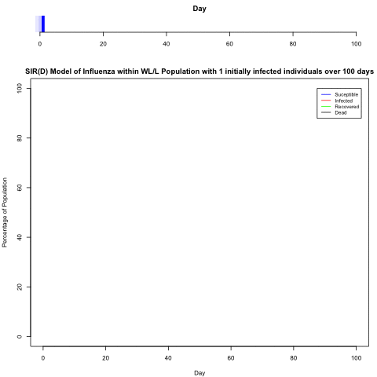
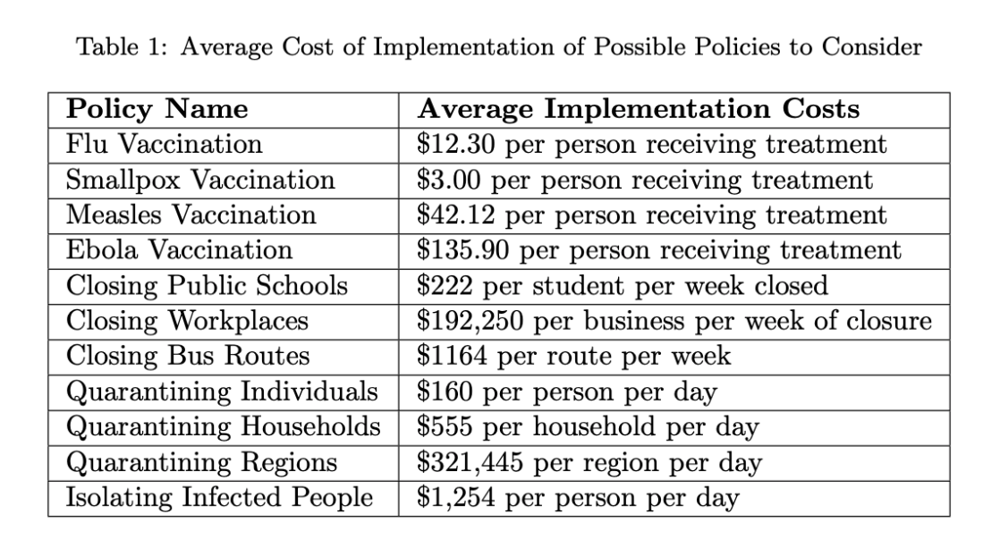

# Epidemic Model
For the cities of West Lafayette and Lafayette IN, this project includes population synthesis, disease spread simulation, and policy recommendation (social distancing, shutdown of schools, bus routes, vaccinations, etc). Further details on Monte Carlo simulation, database design, network modeling, and other procedures can be found [here:](Final_Report.pdf). 

Example of SIR model for the Flu, targeting 10% of the population's most connected individuals, and 3 initial infected individuals:

Costs of different public policies:

A barebones version of the final website is hosted on my personal website: https://www.michaelwang.codes/epidemic/epidemic

